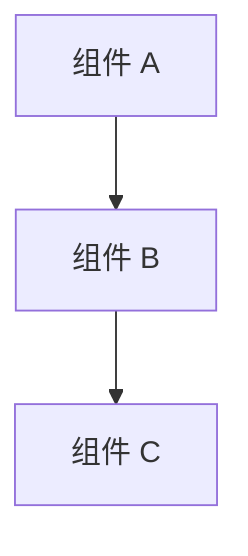

# 设计文档

## 概述

[功能的高级描述及其在整个系统中的位置]

## 指导文档对齐

### 技术标准 (tech.md)
[设计如何遵循记录的技术模式和标准]

### 项目结构 (structure.md)
[实现将如何遵循项目组织约定]

## 代码重用分析

[将利用、扩展或与此功能集成的现有代码]

### 要利用的现有组件
- **[组件/工具名称]**: [如何使用]
- **[服务/助手名称]**: [如何扩展]

### 集成点
- **[现有系统/API]**: [新功能将如何集成]
- **[数据库/存储]**: [数据将如何连接到现有模式]

## 架构

[描述使用的整体架构和设计模式]

### 模块化设计原则
- **单一文件责任**: 每个文件应处理一个特定关注点或领域
- **组件隔离**: 创建小型、专注的组件，而不是大型单体文件
- **服务层分离**: 分离数据访问、业务逻辑和表示层
- **工具模块化**: 将工具分解为专注的、单一用途的模块



## 组件和接口

### 组件 1
- **目的:** [此组件的作用]
- **接口:** [公共方法/API]
- **依赖项:** [它依赖什么]
- **重用:** [它构建的现有组件/工具]

### 组件 2
- **目的:** [此组件的作用]
- **接口:** [公共方法/API]
- **依赖项:** [它依赖什么]
- **重用:** [它构建的现有组件/工具]

## 数据模型

### 模型 1
```
[用您的语言定义 Model1 的结构]
- id: [唯一标识符类型]
- name: [字符串/文本类型]
- [根据需要添加其他属性]
```

### 模型 2
```
[用您的语言定义 Model2 的结构]
- id: [唯一标识符类型]
- [根据需要添加其他属性]
```

## 错误处理

### 错误场景
1. **场景 1:** [描述]
   - **处理:** [如何处理]
   - **用户影响:** [用户看到什么]

2. **场景 2:** [描述]
   - **处理:** [如何处理]
   - **用户影响:** [用户看到什么]

## 测试策略

### 单元测试
- [单元测试方法]
- [要测试的关键组件]

### 集成测试
- [集成测试方法]
- [要测试的关键流程]

### 端到端测试
- [E2E 测试方法]
- [要测试的用户场景]