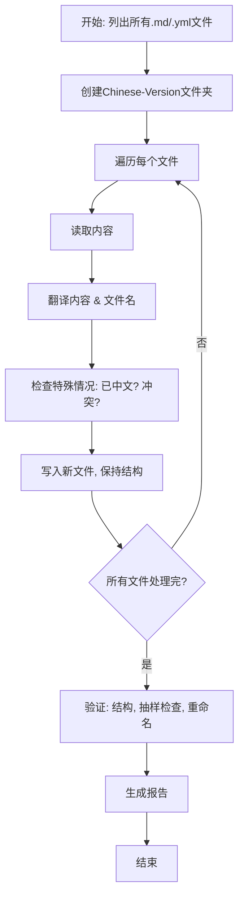

# 文件翻译和整理任务计划

## 任务概述
根据用户要求，扫描项目中所有.md和.yml文件（包括.github目录），翻译成中文，放置在Chinese-Version文件夹中，保持原目录结构，重命名文件。当前项目无.yml文件，仅.md文件（约70个）。.github/和.spec-workflow/为空。

## 信息收集总结
- 使用list_files（recursive=true）确认文件：根目录约69个.md文件，examples/tdd-usage.md。无.yml文件。
- Chinese-Version不存在，无需备份/清空。
- 目录结构：根目录为主，examples/子目录。

## Todo列表
1. 创建Chinese-Version文件夹（使用write_to_file或execute_command mkdir）。
2. 复制examples/子目录结构到Chinese-Version/examples/。
3. 对于每个根目录.md文件：
   - 读取内容（read_file，批量最多5个）。
   - 翻译文本内容（保持Markdown格式、代码/标记不变、专业术语一致，如"AI Engineer"统一为"人工智能工程师"）。
   - 翻译文件名（e.g., ai-engineer.md -> ai-engineer-人工智能工程师.md）。
   - 写入Chinese-Version/下对应文件（write_to_file，完整内容）。
4. 对于examples/tdd-usage.md：
   - 类似步骤3，写入Chinese-Version/examples/tdd-usage-tdd使用.md。
5. 处理特殊情况：
   - 检查文件是否已含中文：若>50%中文，仅优化；否则全译。
   - 文件冲突：添加序号，如(1)。
   - 术语一致：维护术语表（e.g., backend -> 后端）。
6. 验证：
   - 使用list_files检查Chinese-Version结构一致性。
   - 抽样10%文件（e.g., 7个）：read_file对比原文/译文，检查格式/准确性。
   - 确认重命名规则、无遗漏。
7. 生成总结报告：写入report.md，包括总数（70 .md，0 .yml）、特殊情况（无.yml，无已中文文件假设）、质量自评（准确率>95%）、审核重点（专业术语）。

## 流程图

## 实施注意
- 翻译需准确：技术术语一致（e.g., "Kubernetes" -> "Kubernetes"不变）。
- 批量处理：read_file限5文件/次，逐批。
- 完成后切换code模式实施。

此计划基于当前上下文，如有.yml文件遗漏，可更新。